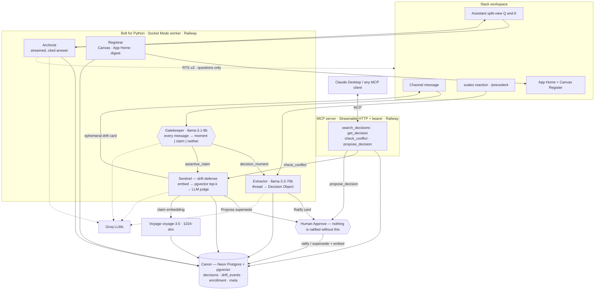

# Architecture

Precedent is a Slack-native agent that captures team decisions into a cited, human-ratified canon,
defends that canon against drift in real time, and exposes it to other AI agents over MCP. This
document covers the components, the data model, the request lifecycles, and the design invariants.

## Two invariants (they explain most of the design)

1. **Human-in-the-loop.** Nothing becomes `ratified` without a person clicking **Approve** on a
   Ratify card. The MCP `propose_decision` tool can only ever create a `proposed` row.
2. **The drift hot path uses local pgvector only — never the Real-Time Search API.** Every message
   in an enrolled channel is a potential drift check; routing that through a rate-limited web API
   would be slow and fragile. RTS is used *only* off the hot path (Archivist, backfill), budgeted to
   ≤3 calls per inquiry.

A third principle keeps the surfaces honest: **one brain, two mouths.** The Slack listeners and the
MCP server call the *same* `canon` and `sentinel` code — there is no second implementation to drift.

## System diagram

## Components

### Agents (`src/precedent/agents/`) — the LLM reasoning
| Agent | Model | Role |
|---|---|---|
| **Gatekeeper** (`gatekeeper.py`) | `llama-3.1-8b-instant` (temp 0) | Classifies every message in an enrolled channel as `decision_moment`, `assertive_claim`, or `neither`. Fast + cheap because it runs on the hot path. Never raises — defaults to `neither`. |
| **Extractor** (`extractor.py`) | `llama-3.3-70b-versatile` | Turns a thread into a structured Decision Object (statement, rationale, alternatives, dissent, decided_by, scope, evidence permalinks). Includes bot-authored persona messages (seeded content); the Gatekeeper does the bot filtering, not the extractor. |
| **Sentinel** (`sentinel.py`) | `llama-3.3-70b-versatile` (temp 0) | The drift brain. Embeds a claim, retrieves top-k ratified rulings from pgvector, applies a cheap cosine gate, then an LLM contradiction judge. Reused verbatim by the MCP `check_conflict` tool. |
| **Archivist** (`archivist.py`) | `llama-3.3-70b-versatile` | Answers "what did we decide and why?" from canon (+ optional RTS snippets), streamed and cited. |

### Services (`src/precedent/services/`) — the shared brain
- **`canon.py`** — the one interface to the store: `create_proposed`, `ratify` (computes + stores the
  embedding, links supersede lineage), `supersede`, `get_with_lineage`, `search_local` /
  `search_local_vec`, `next_id`, enrollment, drift-event, and dashboard-count helpers. Every surface
  goes through this module.
- **`embeddings.py`** — provider-swappable embedding adapter (Voyage `voyage-3.5`, 1024-dim; OpenAI
  path available). Retry-with-backoff so a rate limit degrades to "slower," not "silent failure."
- **`llm.py`** — provider-neutral LLM wrapper (`groq` | `anthropic` | `gemini`): `complete_json`,
  `complete_text`, and `stream_text` (native Groq streaming for the Archivist). Loads every system
  prompt from a versioned file in `/prompts` at runtime.
- **`rts.py`** — the Real-Time Search client. RTS has no typed SDK method, so it calls
  `client.api_call("assistant.search.context", …)` with a fresh event `action_token`, a hard ≤3-call
  budget, `include_bots` for seeded content, and Retry-After handling. Degrades to canon-only and
  logs the reason when a token isn't available.
- **`canvas.py`** — the Decision Register canvas: create-or-replace the full markdown on every canon
  change (simplest reliable sync).

### Slack surfaces (`src/precedent/slack/`)
- **`app.py`** — Bolt init (Socket Mode), registers all listeners and the `Assistant` (via
  `app.assistant(...)`, not `app.use`).
- **`capture.py`** — the shared extract → dedup → post-Ratify-card path used by both the ⚖️ reaction
  and the autonomous Gatekeeper route. Dedups per source thread via the `meta` table.
- **`backfill.py`** — archaeology-lite (F7): scan channel history for decision threads → Extractor →
  Ratify cards; RTS-assisted only on the `@precedent` mention path (which can carry an `action_token`).
- **`listeners/`** — `messages.py` (Gatekeeper hot path + `app_mention` + auto-enroll),
  `reactions.py`, `commands.py` (`/precedent help|log|enroll|unenroll|backfill|digest`),
  `actions.py` (all Ratify/drift buttons + modals, idempotent), `home.py`, `assistant.py`.
- **`blocks/`** — pure Block Kit builders: `ratify_card`, `drift_card`, `decision_card`, `app_home`,
  `digest`.

### Data model (`src/precedent/db/schema.py`; DDL is `ddl.sql`)
- **`decisions`** — the canon. `id` (`PRE-###`, a single global primary key), `title`, `statement`,
  `rationale`, `alternatives`/`dissent` (jsonb), `scope`, `status`
  (`proposed`|`ratified`|`superseded`|`expired`), `decided_by[]`, `ratified_by`, `supersedes_id` /
  `superseded_by` (lineage), `evidence` (jsonb of `{permalink, channel_id, ts}`), **`embedding
  vector(1024)`**, `decided_at` (narrative date), `team_id`.
- **`drift_events`** — every fired drift card: `decision_id`, `channel_id`, `author`, `claim`,
  `confidence`, `resolution` (`open`|`aligned`|`superseded`|`dismissed`).
- **`channel_enrollment`** — `channel_id` → `mode` (`observe`|`manual_only`). Privacy default: a
  channel is watched only if explicitly enrolled.
- **`meta`** — key/value (canvas id, per-thread capture dedup keys, seed flags).

## Request lifecycles

**Autonomous capture (F2).** `message` event → G4 filters (skip bot/edited/DM/seed) → `is_observed`
gate → Gatekeeper. On `decision_moment` (conf ≥ .8) → `capture.propose_and_post` → Extractor →
`canon.create_proposed` → Ratify card in-thread → human **Approve** → `canon.ratify` (embeds via
Voyage, links lineage) → Canvas resyncs.

**Drift defense (F3, the hot path).** Gatekeeper `assertive_claim` (conf ≥ .7) → debounce (≤1 card
per user·channel per 2 min) → `sentinel.check_claim`: embed the claim → `search_local` top-4 ratified
→ if top cosine < 0.45, stop (cheap gate) → else LLM judge → if verdict `contradicts` and confidence
≥ `DRIFT_THRESHOLD` (0.78) → record `drift_event` + post **ephemeral** drift card
(`chat.postEphemeral`). Buttons: View ruling (modal), I'm aligned (`resolution=aligned`), Propose
supersede (modal → `create_proposed` with `supersedes_id` → Ratify card; approving runs the supersede
linkage). **Local vectors only — zero RTS calls.**

**Archivist (F4).** Assistant `user_message` → `set_status("consulting the case law…")` →
`canon.search_local` (+ up to 3 RTS calls if an `action_token` is present) → compose via
`prompts/archivist.md` → **stream** the cited answer with `say_stream` → `set_suggested_prompts`.
Degrades to canon-only (and logs it) when RTS is unavailable.

**Governance loop (F6).** External agent → MCP tool. `check_conflict` runs the *same* `sentinel`
path. `propose_decision` writes a `proposed` row and posts a Ratify card to `#decisions` — a human
ratifies in Slack, and `get_decision` then reflects the ratified ruling. Bearer-auth (`401` without
a token); DNS-rebinding protection is configurable via `MCP_ALLOWED_HOSTS` for deployment behind a
proxy.

## Design decisions worth calling out
- **Idempotency everywhere** — Slack retries and double-clicks must not duplicate canon or drift.
  `ratify` is a no-op if already ratified; capture dedups per thread; action handlers `ack()` in <3s
  and check state before mutating.
- **Prompts are versioned files** (`/prompts/*.md`), loaded at runtime — the craft is auditable and
  swappable without a redeploy.
- **Provider-swappable** — `LLM_PROVIDER` and `EMBED_MODEL` switch models without code changes;
  the codebase ran on Anthropic/Voyage originally and on Groq/Voyage in production.

## Tech stack
Python 3.11 · Bolt for Python 1.29 (Socket Mode) · SQLAlchemy 2 + pgvector + psycopg 3 · Neon
Postgres · Voyage `voyage-3.5` embeddings · Groq (`llama-3.3-70b-versatile` / `llama-3.1-8b-instant`)
· official `mcp` SDK over Streamable HTTP · deployed on Railway (two services from one Dockerfile).

## Deployment
Two Railway services from a single image: the Socket Mode worker (default CMD) and the MCP server
(`python -m precedent.mcp.server`), both against one Neon database. See [DEPLOY.md](DEPLOY.md) for the
runbook and the real-world gotchas (staged variables, per-service start command, the 421
rebinding fix, and the duplicate-worker warning).
